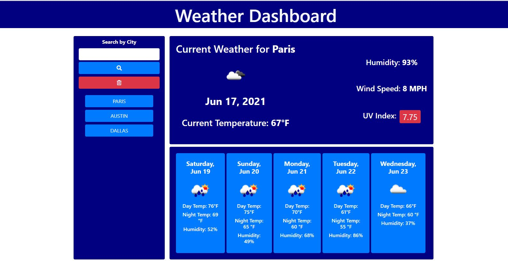

# Work Day Scheduler

<h4>Designed and coded by <a href="https://github.com/fizzaaz">FIZZA ZAIDI</a></h4>
This project was designed as a homework assignment for UT Austin coding bootcamp. This application emphasizes to fetching the data from another application's API and use it to build a weather dashboard that will run in the browser and feature dynamically updated HTML and CSS.

## Getting Started
This project has been deployed to GitHub Pages. To get this project up and running, you can follow the deployment link. Or, download the sources files to use this as a template.

* [GitHub Repository](https://github.com/fizzaaz/weather-dashboard)
* [Deployed GitHub IO](https://fizzaaz.github.io/weather-dashboard/)

### Prerequisites

To install this application, you will need a text editor. I would recommend Visual Studio Code. 

### Installing

To install this code, download the zip file, or use GitHub's guidelines to clone the repository. 

### Summary

This is a weather forecast dashboard app. Users are able to enter a city name in the search box and have current weather conditions displayed for that city, as well a five day forecast. The UV index value will change color from green, yellow and red based on the severity of the UV index. Searched cities will be added below the search button and can be clicked on to display that cities weather data again.

### Features: 
* Current Date
    * This displays the current day at the top of the calendar.

* Time Block
    * This displays the typical business hours (9am to 5pm) in a horizontal layout.
    

* Text Area: 
    * It allows the user to enter their descriptive plan with respect specific business hour displayed in time block.

* Save Button
    * This allows the user to save their plan at a specific business hour in a local storage.

* Local Storage 
    * It is used to store the user's plan at specific time. The set and get methods are used to store and fetch the data from local storage respectively.
    
* Color-coded
    * The three colors are used to indicate the past, present and future event. Grey color indicates that time is past, red indicates that the time is present and green shows that time is future.

### Project Requirements
  * WHEN I search for a city THEN I am presented with current and future conditions for that city and that city is added to the search history
  * WHEN I view current weather conditions for that city THEN I am presented with the city name, the date, an icon representation of weather conditions, the temperature, the humidity, the wind speed, and the UV index.
  * WHEN I view the UV index THEN I am presented with a color that indicates whether the conditions are favorable, moderate, or severe.
  * WHEN I view future weather conditions for that city THEN I am presented with a 5-day forecast that displays the date, an icon representation of weather conditions, the temperature, the wind speed, and the humidity.
  * WHEN I click on a city in the search history THEN I am again presented with current and future conditions for that city.
  
 
### This project has script features of:
* Tells browser to load 1)html & 2)css first.
* Display current day.
* An event listener (onclick) that generates time interval
* Taken the change from the sibling html description attribute
* Taken the change from the parent html id attribute
* Set items in local storage.
* Get items from the local storage.
* Get current number of hours.
* Should follow html 24 hour to 12 hour conversion.
* use of moment.js
* loop over time blocks
* check if we've moved past this time, or we're in present, or future
* 
### File Types: 
* HTML
    * Index.html 
        * Contains the links to moment.js and bootstrap libraries.
        * Contains the basic information display on a browser and the basic structure of a application that is featured by jQuery.
* CSS Page
    * Styles.css
        * contains styling properties for html elements
* Javascript Page
    * script.js 
        * Variables
        * Event listeners
        * if/else if statements
        * For Loops
        * Functions 
        * Local Storage set and get function
 
