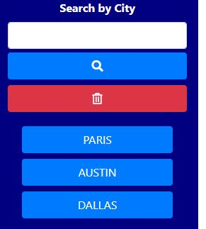
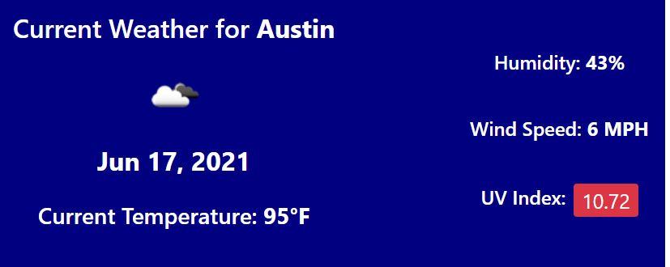
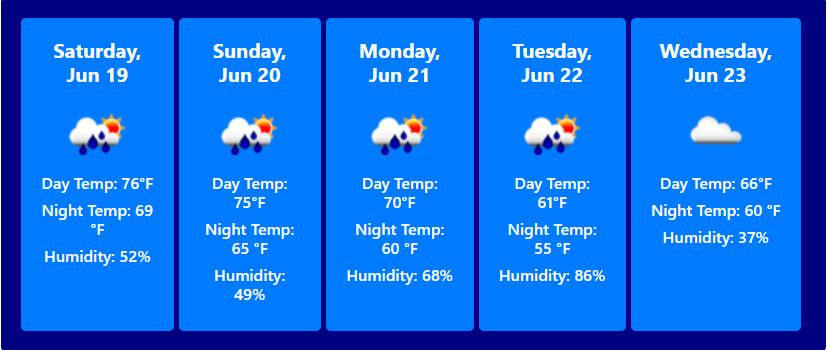

# Work Day Scheduler

<h4>Designed and coded by <a href="https://github.com/fizzaaz">FIZZA ZAIDI</a></h4>
This project was designed as a homework assignment for UT Austin coding bootcamp. This application emphasizes to fetching the data from another application's API and use it to build a weather dashboard that will run in the browser and feature dynamically updated HTML and CSS.

## Getting Started
This project has been deployed to GitHub Pages. To get this project up and running, you can follow the deployment link. Or, download the sources files to use this as a template.

* [GitHub Repository](https://github.com/fizzaaz/weather-dashboard)
* [Deployed GitHub IO](https://fizzaaz.github.io/weather-dashboard/)

### Prerequisites

To install this application, you will need a text editor. I would recommend Visual Studio Code. 

### Installing

To install this code, download the zip file, or use GitHub's guidelines to clone the repository. 

### Summary

This is a weather forecast dashboard app. Users are able to enter a city name in the search box and have current weather conditions displayed for that city, as well a five days forecast. The UV index value will change color from green, yellow and red based on the severity of the UV index. Searched cities will be added below the search button and can be clicked on to display that cities weather data again.

### Goal

This app was created using the Open Weather Map data API. In order to get all the information needed, a good deal of manipulation of the response from the get request was needed, including taking information from one response to generate a new request. For example, the initial search based on city name returns latitude and longitude coordinates, and these coordinates are used in the UV Index get request.

### Features: 
* Search Section
    * This allows the user to enter the city to see the weather condition of that city. Also, buttons are created dynamically of previously searched cities.

* Current weather forecast
    * This displays the current weather forecast of the entered city. This block displays the uv index, temperature , wind speed , humidity , icon and current date.
    

* 5 day forecast
    * Displays the 5 day forecast of searched city in the flexboxes. 

* Icon
    * Displays the weather situation using pictorial representation. 

* UV index
    * Displays the current weather situation by changing the color from green, yellow and red according to the severity of the UV index. 
 

### Project Requirements
  * WHEN the user searchs for a city THEN the user is presented with current and future conditions for that city and that city is added to the search history.
  * WHEN the user view current weather conditions for that city THEN the user presented with the city name, the date, an icon representation of weather conditions, the temperature, the humidity, the wind speed, and the UV index.
  * WHEN the user view the UV index THEN the user is presented with a color that indicates whether the conditions are favorable, moderate, or severe.
  * WHEN the user view future weather conditions for that city THEN the user is presented with a 5-day forecast that displays the date, an icon representation of weather conditions, the temperature, the wind speed, and the humidity.
  * WHEN the user clicks on a city in the search history THEN the user is again presented with current and future conditions for that city.
   
### File Types: 
* HTML
    * Index.html 
        * Contains the links to moment.js and bootstrap libraries.
        * Contains the basic information display on a browser and the basic structure of a application that is featured by Javascript and css.
* CSS Page
    * Styles.css
        * contains styling properties for html elements
* Javascript Page
    * script.js 
        * Variables
        * Event listeners
        * if/else if statements
        * For Loops
        * Functions 
        * Local Storage set and get function
        * API
 
